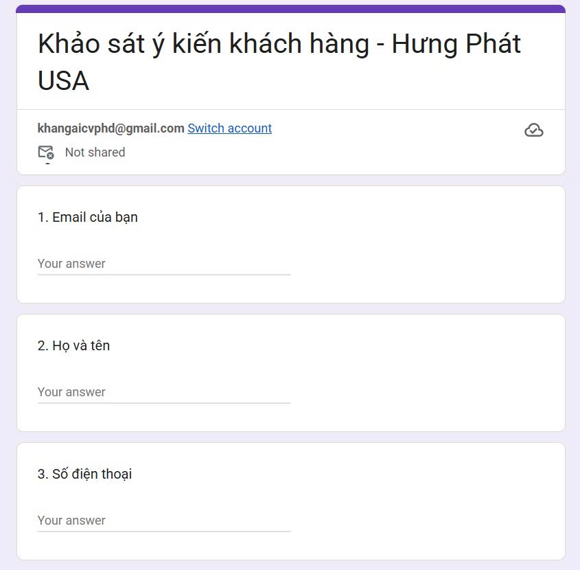
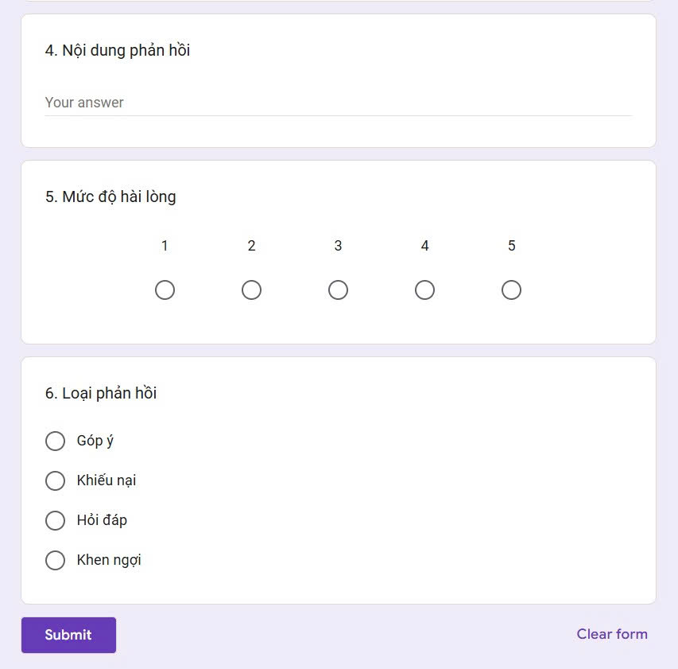
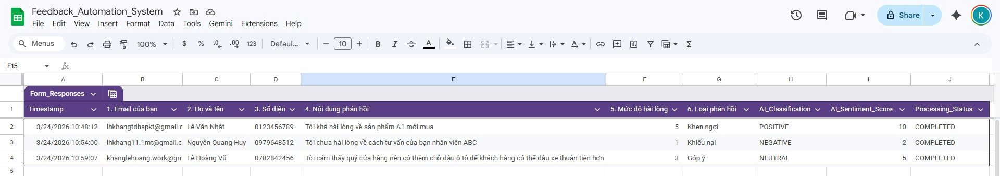
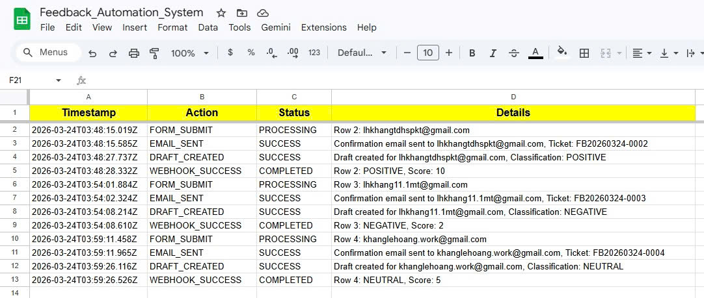
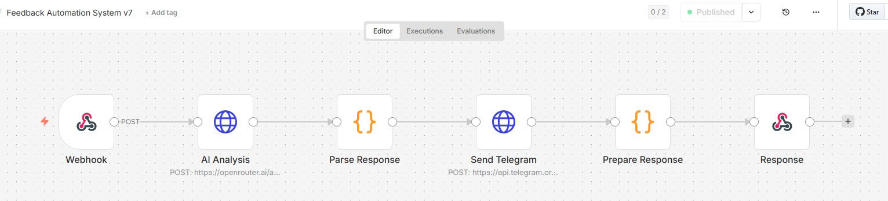
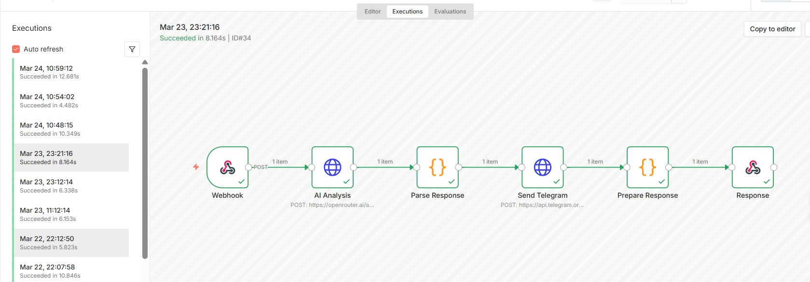
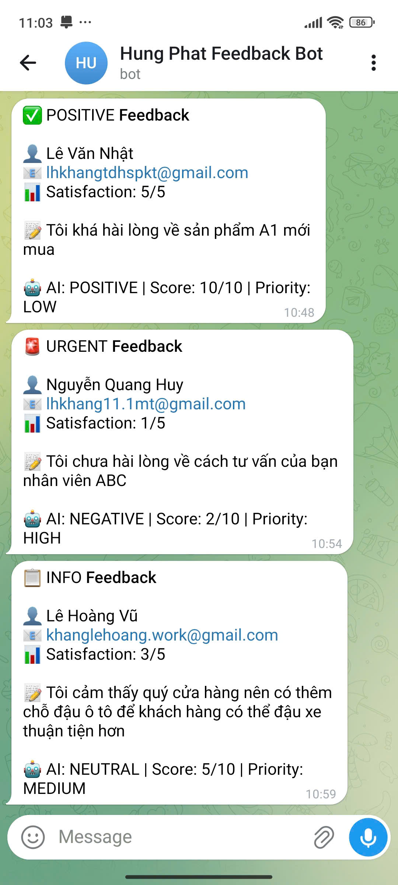
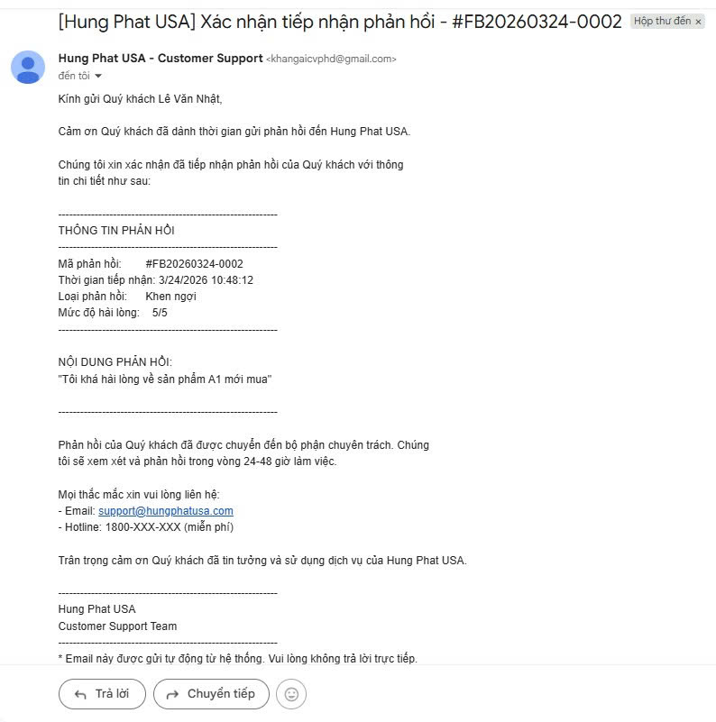
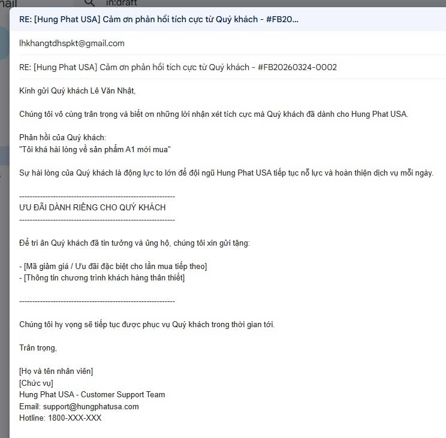
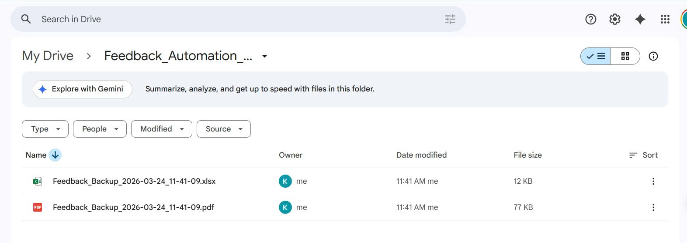

# AI-Powered Customer Feedback Automation System

> Hệ thống tự động phân loại và xử lý feedback khách hàng bằng AI

[](https://script.google.com/)
[](https://n8n.io/)
[](https://docker.com/)
[](https://openrouter.ai/)

---

## Demo Screenshots

### Google Form - Thu thập feedback
<p align="center">
  
  
</p>

### Google Sheets - Kết quả phân loại AI
<p align="center">
  
</p>

### System Logs - Nhật ký hệ thống
<p align="center">
  
</p>

### n8n Workflow - Automation Flow
<p align="center">
  
</p>

### n8n Execution - Kết quả chạy workflow
<p align="center">
  
</p>

### Telegram Alerts - Thông báo real-time
<p align="center">
  
</p>

### Email Confirmation - Xác nhận tự động
<p align="center">
  
</p>

### Email Draft - Mẫu phản hồi tự động
<p align="center">
  
</p>

### Google Drive Backup - Sao lưu dữ liệu
<p align="center">
  
</p>

---

## Table of Contents

- [Overview](#overview)
- [Demo Screenshots](#demo-screenshots)
- [Features](#features)
- [System Architecture](#system-architecture)
- [Tech Stack](#tech-stack)
- [Installation](#installation)
- [Configuration](#configuration)
- [Usage](#usage)
- [API Documentation](#api-documentation)
- [Troubleshooting](#troubleshooting)
- [Future Improvements](#future-improvements)
- [Author](#author)

---

## Overview

Hệ thống automation end-to-end giúp doanh nghiệp tự động thu thập, phân loại và phản hồi feedback khách hàng sử dụng AI. Được thiết kế với chi phí **$0** bằng cách sử dụng các công cụ miễn phí.

### Business Problem Solved

- **Manual Processing**: Nhân viên phải đọc và phân loại từng feedback thủ công
- **Slow Response Time**: Khách hàng phải chờ lâu để được phản hồi
- **Inconsistent Classification**: Phân loại không nhất quán giữa các nhân viên
- **No Real-time Alerts**: Không có cảnh báo kịp thời cho feedback tiêu cực

### Solution

Hệ thống tự động:
1. Thu thập feedback qua Google Form
2. Phân loại bằng AI (Positive/Negative/Neutral)
3. Gửi alert real-time qua Telegram
4. Tự động gửi email xác nhận cho khách hàng
5. Tạo draft email phản hồi dựa trên sentiment
6. Backup dữ liệu định kỳ lên Google Drive

---

## Features

### Core Features

| Feature | Description | Status |
|---------|-------------|--------|
| Form Collection | Thu thập feedback qua Google Form | ✅ Done |
| AI Classification | Phân loại sentiment (Positive/Negative/Neutral) | ✅ Done |
| Sentiment Scoring | Đánh giá mức độ cảm xúc (1-10) | ✅ Done |
| Real-time Alerts | Gửi thông báo Telegram tức thì | ✅ Done |
| Auto Email Confirmation | Gửi email xác nhận tự động | ✅ Done |
| Smart Draft Response | Tạo draft phản hồi theo sentiment | ✅ Done |
| Google Drive Backup | Backup tự động hàng tuần | ✅ Done |
| Error Handling | Retry logic và error logging | ✅ Done |

### Email Features

- **Confirmation Email**: Gửi ngay khi nhận feedback với Ticket ID
- **Draft Response Templates**:
  - NEGATIVE: Template xin lỗi + phương án giải quyết
  - POSITIVE: Template cảm ơn + giữ chân khách hàng
  - NEUTRAL: Template phản hồi chuẩn

### Monitoring & Logging

- System_Logs sheet: Ghi lại mọi action
- Backup_Log sheet: Lịch sử backup
- Dashboard sheet: Thống kê tổng quan

---

## System Architecture

```
┌─────────────────────────────────────────────────────────────────────────────┐
│                        FEEDBACK AUTOMATION SYSTEM                           │
└─────────────────────────────────────────────────────────────────────────────┘

┌──────────────┐     ┌──────────────┐     ┌──────────────┐     ┌──────────────┐
│   Customer   │     │   Google     │     │   Google     │     │    Apps      │
│   submits    │────▶│    Form      │────▶│   Sheets     │────▶│   Script     │
│   feedback   │     │              │     │              │     │  (Trigger)   │
└──────────────┘     └──────────────┘     └──────────────┘     └──────┬───────┘
                                                                       │
                     ┌─────────────────────────────────────────────────┘
                     │
                     ▼
┌──────────────┐     ┌──────────────┐     ┌──────────────┐     ┌──────────────┐
│    Gmail     │◀────│   Google     │     │    ngrok     │     │     n8n      │
│  (Email &    │     │   Apps       │◀────│   (Tunnel)   │◀────│  (Workflow)  │
│   Drafts)    │     │   Script     │     │              │     │              │
└──────────────┘     └──────┬───────┘     └──────────────┘     └──────┬───────┘
                            │                                          │
                            ▼                                          ▼
                     ┌──────────────┐                           ┌──────────────┐
                     │   Google     │                           │  OpenRouter  │
                     │    Drive     │                           │   AI API     │
                     │  (Backup)    │                           │  (Free Tier) │
                     └──────────────┘                           └──────┬───────┘
                                                                       │
                                                                       ▼
                                                                ┌──────────────┐
                                                                │   Telegram   │
                                                                │     Bot      │
                                                                │   (Alert)    │
                                                                └──────────────┘
```

### Data Flow

```
1. Customer submits feedback via Google Form
                    │
                    ▼
2. Data saved to Google Sheets (Form Responses 1)
                    │
                    ▼
3. Apps Script trigger fires (onFormSubmit)
                    │
                    ├──▶ Send confirmation email to customer
                    │
                    ▼
4. Data sent to n8n webhook (via ngrok tunnel)
                    │
                    ▼
5. n8n workflow processes:
   ├── Call OpenRouter AI for sentiment analysis
   ├── Parse AI response
   └── Send Telegram alert
                    │
                    ▼
6. Apps Script receives AI result:
   ├── Update Sheet (Classification, Score, Status)
   ├── Create draft email response
   └── Log action
                    │
                    ▼
7. Weekly: Auto backup to Google Drive
```

---

## Tech Stack

### Free Tools Used ($0 Cost)

| Component | Tool | Purpose |
|-----------|------|---------|
| Workflow Automation | n8n (self-hosted) | Orchestrate the automation flow |
| AI Model | StepFun Step-3.5-Flash | Sentiment analysis (via OpenRouter) |
| Scripting | Google Apps Script | Triggers, email, Drive integration |
| Data Storage | Google Sheets | Store feedback & results |
| Form | Google Forms | Collect customer feedback |
| Tunnel | ngrok (free tier) | Expose localhost to internet |
| Notifications | Telegram Bot | Real-time alerts |
| Email | Gmail | Confirmation & response drafts |
| Backup | Google Drive | Weekly data backup |
| Container | Docker | Run n8n locally |

### Why These Tools?

- **n8n**: Open-source, self-hosted, no execution limits
- **OpenRouter**: Free AI models (step-3.5-flash:free)
- **Google Workspace**: Free tier đủ cho use case này
- **Telegram**: Free, no Workspace account required (unlike Google Chat)

---

## Installation

### Prerequisites

- Docker Desktop installed
- Google Account
- Telegram Account
- OpenRouter Account (free)
- ngrok Account (free)

### Step 1: Clone Repository

```bash
git clone https://github.com/YOUR_USERNAME/feedback-automation-ai.git
cd feedback-automation-ai
```

### Step 2: Setup n8n with Docker

```bash
cd docker
docker-compose up -d
```

Access n8n at: http://localhost:5678

### Step 3: Setup ngrok

```bash
# Download ngrok from https://ngrok.com/download
# Login and get auth token

ngrok config add-authtoken YOUR_AUTH_TOKEN

# Run ngrok to expose n8n
ngrok http 5678
```

> **Note**: ngrok URL changes on each restart (free tier). Update Apps Script when URL changes.

### Step 4: Create Google Form

Create a form with these fields:
1. Email (Short answer, required)
2. Full Name (Short answer, required)
3. Phone (Short answer, optional)
4. Feedback Content (Paragraph, required)
5. Satisfaction Level (Multiple choice: 1, 2, 3, 4, 5)
6. Feedback Type (Multiple choice: Khiếu nại, Góp ý, Khen ngợi, Hỗ trợ, Khác)

Link form to a Google Sheet.

### Step 5: Setup Google Sheets

Add these sheets to your spreadsheet:
- **Form Responses 1**: Main data (add columns H, I, J)
- **Dashboard**: Statistics
- **System_Logs**: Action logs
- **Backup_Log**: Backup history

**Additional Columns in Form Responses 1:**

| Column | Header | Purpose |
|--------|--------|---------|
| H | AI_Classification | POSITIVE/NEGATIVE/NEUTRAL |
| I | AI_Sentiment_Score | 1-10 score |
| J | Processing_Status | COMPLETED/FAILED/ERROR |

### Step 6: Setup Telegram Bot

1. Message @BotFather on Telegram
2. Send `/newbot` and follow instructions
3. Save the Bot Token
4. Get your Chat ID:
   - Message your bot
   - Visit: `https://api.telegram.org/bot<TOKEN>/getUpdates`
   - Find `chat.id` in response

### Step 7: Setup OpenRouter

1. Go to https://openrouter.ai/keys
2. Create new API key (free)
3. Use model: `stepfun/step-3.5-flash:free`

### Step 8: Import n8n Workflow

1. Open n8n (http://localhost:5678)
2. Create new workflow
3. Import from file: `workflows/n8n-workflow.json`
4. Update credentials:
   - OpenRouter API Key (in "AI Analysis" node)
   - Telegram Bot Token (in "Send Telegram" node)
   - Telegram Chat ID (in "Send Telegram" node)
5. Click **"Publish"** to activate

### Step 9: Setup Google Apps Script

1. Open Google Sheet > Extensions > Apps Script
2. Delete default code
3. Copy & paste content from `src/google-apps-script.js`
4. Update CONFIG section:
   - `N8N_WEBHOOK_URL`: Your ngrok URL + `/webhook/feedback-webhook`
   - `COMPANY_NAME`: Your company name
   - `SUPPORT_EMAIL`: Your support email
5. Run `setupAllTriggers()` function
6. Authorize permissions when prompted

---

## Configuration

### Google Apps Script CONFIG

```javascript
const CONFIG = {
  // Webhook - Update when ngrok URL changes
  N8N_WEBHOOK_URL: 'https://your-ngrok-url.ngrok-free.dev/webhook/feedback-webhook',
  
  // Sheets
  SHEET_NAME: 'Form Responses 1',
  LOG_SHEET: 'System_Logs',
  BACKUP_SHEET: 'Backup_Log',
  
  // Email
  COMPANY_NAME: 'Your Company Name',
  SUPPORT_EMAIL: 'support@yourcompany.com',
  ENABLE_CONFIRMATION_EMAIL: true,
  ENABLE_DRAFT_RESPONSE: true,
  
  // Backup
  BACKUP_FOLDER_NAME: 'Feedback_Automation_Backups',
  ENABLE_AUTO_BACKUP: true
};
```

### n8n Workflow Nodes

| Node | Type | Purpose |
|------|------|---------|
| Webhook | Trigger | Receive data from Apps Script |
| AI Analysis | HTTP Request | Call OpenRouter AI API |
| Parse Response | Code | Parse AI response |
| Send Telegram | HTTP Request | Send alert message |
| Prepare Response | Code | Format response for Apps Script |
| Response | Respond to Webhook | Return result |

---

## Usage

### Daily Operations

System runs automatically when customers submit feedback. No manual intervention needed.

### Manual Operations

**Test webhook connection:**
```javascript
// In Apps Script Editor, run:
testWebhookConnection()
```

**Test email:**
```javascript
testConfirmationEmail()
testDraftResponse()
```

**Test backup:**
```javascript
testDriveBackup()
```

**Reprocess failed rows:**
```javascript
reprocessFailedRows()
```

**Manual backup:**
```javascript
backupToGoogleDrive()
```

### Monitoring

Check these locations for system status:
- **System_Logs sheet**: All actions with timestamps
- **n8n Executions tab**: Workflow execution history
- **Telegram**: Real-time alerts

---

## API Documentation

### Webhook Endpoint

**URL:** `POST /webhook/feedback-webhook`

**Request Body:**
```json
{
  "rowNumber": 5,
  "timestamp": "2024-03-22T10:30:00Z",
  "email": "customer@example.com",
  "fullName": "Nguyen Van A",
  "phone": "0123456789",
  "feedbackContent": "Sản phẩm rất tốt, giao hàng nhanh!",
  "satisfactionLevel": 5,
  "feedbackType": "Khen ngợi",
  "spreadsheetId": "...",
  "spreadsheetUrl": "..."
}
```

**Response:**
```json
{
  "success": true,
  "classification": "POSITIVE",
  "sentimentScore": 9
}
```

### AI Classification Categories

| Classification | Criteria | Priority |
|----------------|----------|----------|
| POSITIVE | Satisfaction >= 4, praise keywords | LOW |
| NEGATIVE | Satisfaction <= 2, complaint keywords | HIGH |
| NEUTRAL | Satisfaction = 3, neutral content | MEDIUM |
| TECHNICAL | Support requests, questions | MEDIUM |

---

## Troubleshooting

### Common Issues

| Issue | Cause | Solution |
|-------|-------|----------|
| Webhook not responding | ngrok URL changed | Update `CONFIG.N8N_WEBHOOK_URL` in Apps Script |
| AI returns UNKNOWN | OpenRouter rate limit | Wait 1-2 minutes, retry |
| Email not sent | Permission not granted | Re-run `setupAllTriggers()`, authorize |
| Telegram not received | Wrong Chat ID | Verify Chat ID with getUpdates API |
| n8n workflow inactive | Not published | Click "Publish" in n8n |

### Debug Steps

1. **Check Apps Script Logs:**
   - View > Logs in Apps Script editor

2. **Check n8n Executions:**
   - Open n8n > Executions tab

3. **Test Components Individually:**
   ```javascript
   testWebhookConnection()  // Test n8n connection
   testConfirmationEmail()  // Test Gmail
   testDriveBackup()        // Test Drive
   ```

4. **Check System_Logs sheet** for detailed error messages

### ngrok URL Update Checklist

When ngrok URL changes:
1. Copy new URL from ngrok terminal
2. Update `CONFIG.N8N_WEBHOOK_URL` in Apps Script
3. Save and run `testWebhookConnection()` to verify

---

## Project Structure

```
feedback-automation-ai/
├── README.md                    # This documentation
├── .gitignore                   # Git ignore rules
├── src/
│   └── google-apps-script.js    # Apps Script source code
├── workflows/
│   └── n8n-workflow.json        # n8n workflow (import this)
├── docker/
│   └── docker-compose.yml       # Docker config for n8n
└── docs/
    └── screenshots/             # Demo screenshots (add your own)
```

---

## Key Metrics

| Metric | Value |
|--------|-------|
| Total Cost | $0 |
| Setup Time | ~2 hours |
| Response Time | < 5 seconds |
| AI Accuracy | ~90% |

---

## Future Improvements

### Phase 2
- [ ] Dashboard with charts (Google Data Studio)
- [ ] Sentiment trend analysis over time
- [ ] Multi-language support

### Phase 3
- [ ] Integration with CRM systems
- [ ] Auto-response for simple queries
- [ ] Mobile app for monitoring

---

## Lessons Learned

1. **Google Chat requires Workspace account** → Use Telegram as free alternative
2. **ngrok URL changes on restart** → Need static URL for production ($)
3. **Free AI models have rate limits** → Implement retry logic
4. **Webhook data structure** → n8n wraps POST data in `$json.body`
5. **Error handling is crucial** → Retry logic prevents data loss

---

## Author

**Le Hoang Khang**

Portfolio project for AI Automation Engineer position.

---

## License

MIT License - Feel free to use and modify for your own projects.
